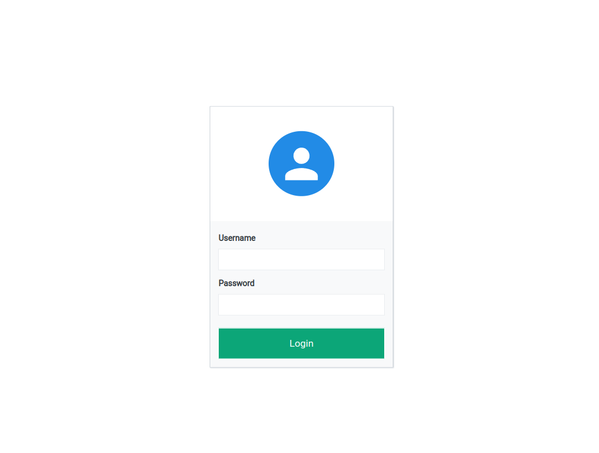
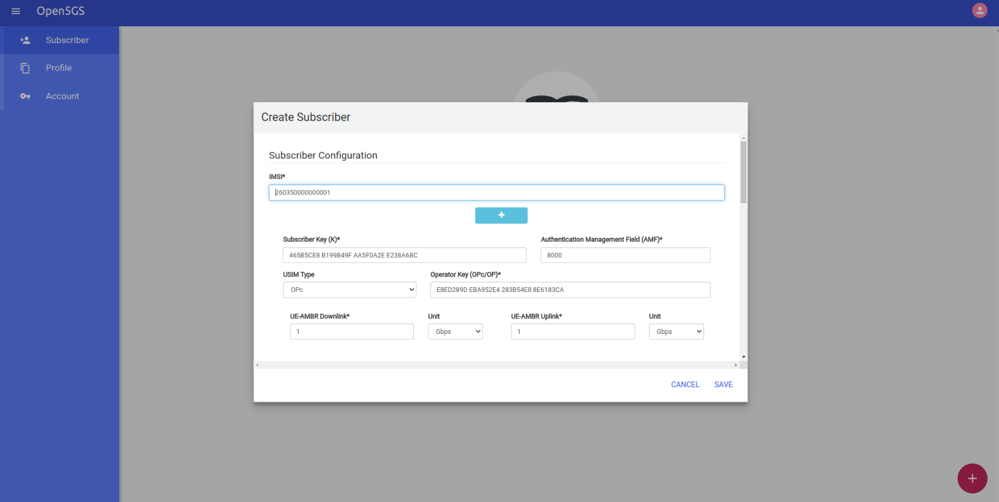
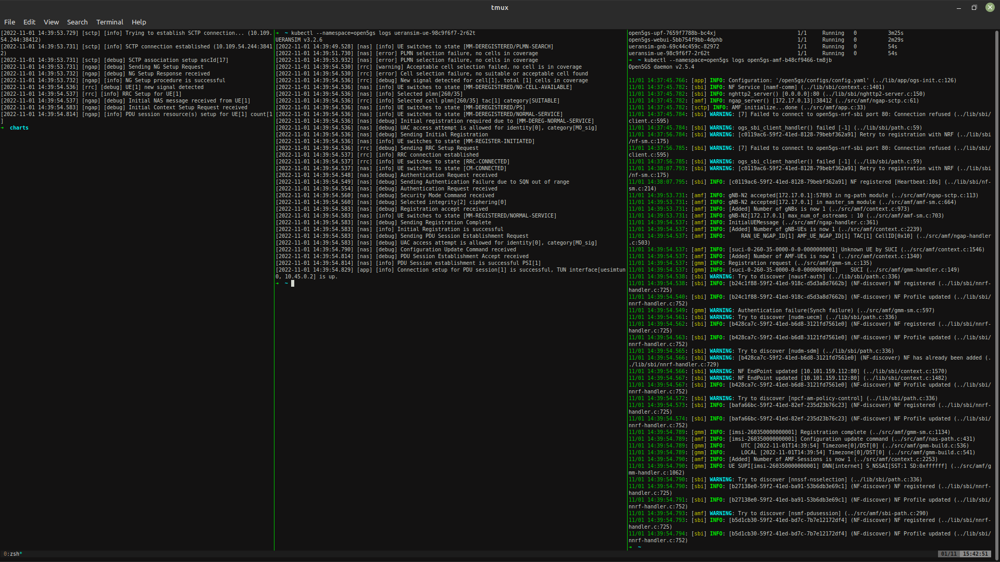
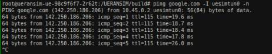

#### Open5gs 5g SA deploy (  with UERANSIM to test ) 

go inside charts/open5gs-5gcore and run 
```console
cd charts/open5gs-5gcore
helm dependency update
```

configuration for specific NFs exists in open5gs-5gcore/values.yaml

start 
```console
cd ..
helm install open5gs  ./open5gs-5gcore --namespace open5gs --create-namespace
```
result
```console
➜  charts kubectl --namespace=open5gs get deploy
NAME                                 READY   UP-TO-DATE   AVAILABLE   AGE
open5gs-5gcore-debugging-container   1/1     1            1           2m34s
open5gs-amf                          1/1     1            1           2m34s
open5gs-ausf                         1/1     1            1           2m34s
open5gs-bsf                          1/1     1            1           2m34s
open5gs-mongodb                      1/1     1            1           2m34s
open5gs-nrf                          1/1     1            1           2m34s
open5gs-nssf                         1/1     1            1           2m34s
open5gs-pcf                          1/1     1            1           2m34s
open5gs-smf                          1/1     1            1           2m34s
open5gs-udm                          1/1     1            1           2m34s
open5gs-udr                          1/1     1            1           2m34s
open5gs-upf                          1/1     1            1           2m34s
```

along with 5g core one debugging container will be started
we can admin user like here 
https://github.com/open5gs/open5gs/blob/main/docs/assets/webui/install#L278

after this deploy webui

```console
helm install -n open5gs open5gs-webui ./open5gs-webui
```

can be logged using admin 1423



adding new ue 



Now we can test with ueransim 

```console
helm -n open5gs install ueransim  ./ueransim
```

logs from gnb ue and amf we can see here




lets test ping from ue




